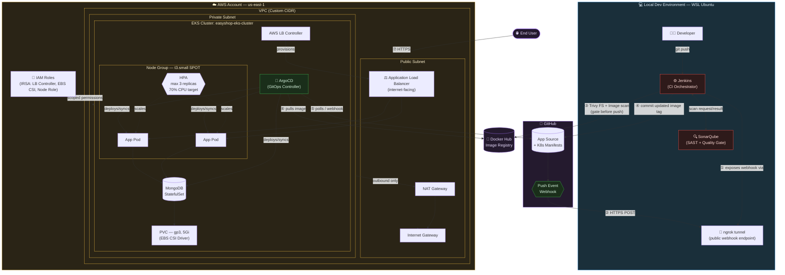
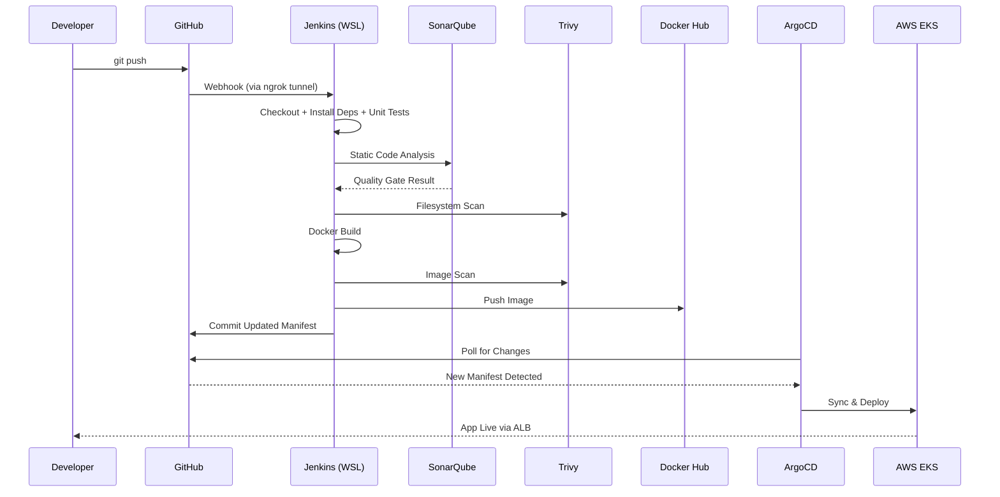
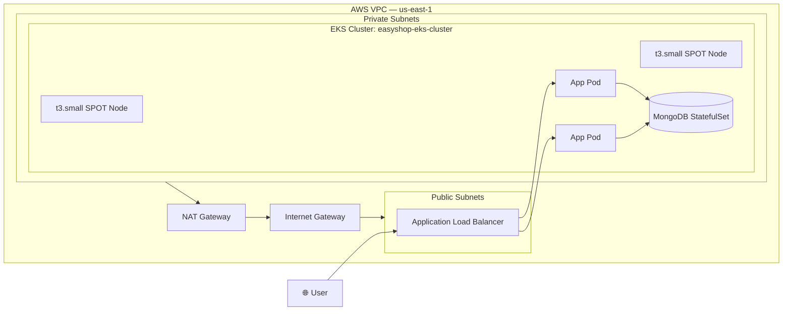
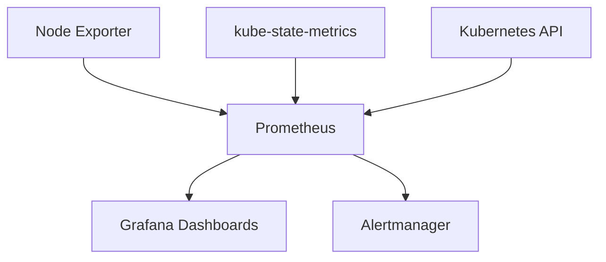

<div align="center">

# 🛒 EasyShop DevSecOps GitOps Platform

### Production-Style CI/CD Pipeline with Integrated Security Scanning & GitOps Delivery

*From `git push` to a running pod on AWS EKS — fully automated, security-gated, and self-healing.*

[](https://aws.amazon.com/eks/)
[](https://www.terraform.io/)
[](https://www.jenkins.io/)
[](https://argo-cd.readthedocs.io/)
[](https://www.sonarqube.org/)
[](https://aquasecurity.github.io/trivy/)
[](https://www.docker.com/)
[](https://kubernetes.io/)
[](https://prometheus.io/)
[](https://grafana.com/)
[](https://nextjs.org/)
[](#license)

</div>

---

## 📖 The Story Behind This Project

Most CI/CD demos stop at "build a Docker image and deploy it." That's not how production teams actually ship software — and it's not what this project set out to prove.

**EasyShop** is a full-stack e-commerce application (Next.js 14, TypeScript, MongoDB 7.0) that I use as the *payload* for a much bigger goal: building a pipeline that looks and behaves like the ones running inside real engineering organizations. Every commit to this repo has to survive static code analysis, filesystem and image vulnerability scanning, and a GitOps-controlled rollout — before it ever touches a live pod on AWS EKS.

I built this end-to-end myself: the Terraform that provisions the cluster, the Jenkins pipeline that gates every build, the ArgoCD application that keeps the cluster in sync with Git, and the Kubernetes manifests that define how the app actually runs in production — autoscaling, persistent storage, and all.

This README documents the platform as it's actually built and run, not as a theoretical blueprint.

---

## 🧭 Table of Contents

- [Architecture](#-architecture)
- [Tech Stack](#-tech-stack)
- [Features](#-features)
- [CI/CD Pipeline Flow](#-cicd-pipeline-flow)
- [Jenkins Pipeline Stages](#-jenkins-pipeline-stages)
- [AWS Infrastructure](#-aws-infrastructure)
- [Kubernetes Resources](#-kubernetes-resources)
- [Security Implementation](#-security-implementation)
- [Project Structure](#-project-structure)
- [Deployment Guide](#-deployment-guide)
- [Screenshots](#-screenshots)
- [Monitoring & Observability](#-monitoring--observability-phase-2)
- [Troubleshooting](#-troubleshooting)
- [Learning Outcomes](#-learning-outcomes)
- [Future Enhancements](#-future-enhancements)
- [License](#license)

---

## 🏗️ Architecture



**What this adds over a simple pipeline arrow-chain:**

- **Trust boundaries are explicit** — `DevZone`, `GitHubZone`, and `AWSZone` are separate subgraphs because they *are* separate security domains with different network reachability rules, not just "steps."
- **The two webhook directions are numbered (①–⑦)** so it's clear which calls are inbound-to-Jenkins (needs ngrok) versus outbound-from-cluster (doesn't).
- **Private subnet has no direct route to the internet** — only outbound via NAT Gateway, which is why the EKS nodes/pods themselves are never directly exposed; only the ALB in the public subnet is internet-facing.
- **IAM is shown as a cross-cutting concern (IRSA)** scoped to specific controllers (LB Controller, EBS CSI Driver, node role) rather than one blanket cluster-admin role — this is the kind of detail that signals real production awareness in an interview.
- **HPA and ArgoCD are drawn as active controllers**, not passive boxes — HPA scales pods based on CPU, ArgoCD continuously reconciles pod/StatefulSet state against Git.

The two loops that matter here are easy to miss on a first read, so it's worth calling them out explicitly:

**CI loop (Jenkins):** runs locally on WSL Ubuntu. Since GitHub can't reach a `localhost` endpoint, the webhook is exposed publicly via `ngrok`, which tunnels incoming push events straight into the local Jenkins instance.

**CD loop (ArgoCD):** runs *inside* the EKS cluster, which has outbound internet access by default. ArgoCD doesn't need any tunnel — it reaches out to GitHub on its own polling interval (or via its own webhook) to detect manifest changes and reconcile cluster state.

Jenkins never talks to the cluster directly. It only ever commits an updated image tag to Git — ArgoCD is the only thing with deploy authority. That separation is the entire point of GitOps: the cluster's desired state lives in Git, not in a pipeline script.

---

## 🧰 Tech Stack

| Layer | Tool | Purpose |
|---|---|---|
| **Cloud Provider** | AWS | Hosting for EKS, networking, and compute |
| **IaC** | Terraform | Declarative provisioning of VPC, EKS, and IAM |
| **Containerization** | Docker | Application packaging |
| **Orchestration** | Kubernetes on AWS EKS | Container scheduling and scaling |
| **CI** | Jenkins (self-hosted, WSL Ubuntu) | Build, test, and security-scan automation |
| **GitOps / CD** | ArgoCD | Declarative, Git-driven deployment |
| **Source Control** | GitHub | Application + manifest repository, webhook trigger |
| **Registry** | Docker Hub | Versioned image storage |
| **Code Quality** | SonarQube (self-hosted, WSL Ubuntu) | Static analysis, code smells, bugs, vulnerabilities |
| **Security Scanning** | Trivy | Filesystem and container image vulnerability scanning |
| **Database** | MongoDB 7.0 | Application data store |
| **Application** | Next.js 14 + TypeScript | E-commerce frontend/backend |
| **Package Manager** | Helm | Deploying the monitoring stack chart |
| **Metrics Collection** | Prometheus | Cluster and workload metrics scraping |
| **Visualization** | Grafana | Pre-provisioned dashboards for cluster/node/pod/workload metrics |
| **Alerting** | Alertmanager | Alert routing and management |
| **Operator** | Prometheus Operator | Manages Prometheus resources declaratively |
| **Object Metrics** | kube-state-metrics | Kubernetes object state metrics |
| **Node Metrics** | Node Exporter | Host-level CPU, memory, disk, network metrics |

---

## ✨ Features

| | Capability |
|---|---|
| ✔ | Infrastructure provisioning fully automated via Terraform |
| ✔ | Automated Jenkins CI pipeline triggered on every push |
| ✔ | SonarQube static code analysis with an enforced quality gate |
| ✔ | Trivy vulnerability scanning at both filesystem and image stages |
| ✔ | Docker image build and versioned push to Docker Hub |
| ✔ | GitOps workflow — Git as the single source of truth for cluster state |
| ✔ | Automatic ArgoCD sync on manifest changes |
| ✔ | Kubernetes-native deployment on AWS EKS |
| ✔ | MongoDB StatefulSet with stable network identity |
| ✔ | Persistent storage via `gp3`-backed PVC |
| ✔ | Horizontal Pod Autoscaler (CPU-based, max 3 replicas) |
| ✔ | Internet-facing ingress via AWS Application Load Balancer |
| ✔ | End-to-end automation — a single `git push` triggers the full build-to-deploy chain |

---

## 🔄 CI/CD Pipeline Flow



---

## ⚙️ Jenkins Pipeline Stages

| # | Stage | Description |
|---|---|---|
| 1 | Clean Workspace | Ensures a clean build environment for every run |
| 2 | Checkout Code | Pulls latest commit from GitHub |
| 3 | Install Dependencies | `npm install` for the Next.js application |
| 4 | Run Unit Tests | Executes application test suite |
| 5 | SonarQube Analysis | Static code analysis against a defined quality gate |
| 6 | Trivy Filesystem Scan | Scans source and dependencies for known CVEs |
| 7 | Build Docker Image | Builds the application container image |
| 8 | Trivy Image Scan | Scans the built image before it's allowed to ship |
| 9 | Push Docker Image | Pushes tagged image to Docker Hub |
| 10 | Update K8s Manifest | Updates the image tag in the deployment manifest |
| 11 | Commit Manifest Changes | Commits the manifest update back to Git |
| 12 | Push to GitHub | Pushes the commit that ArgoCD will detect |
| 13 | ArgoCD Sync | ArgoCD reconciles cluster state with Git |
| 14 | Application Deployment | New version rolls out on EKS |

<details>
<summary><b>Why security scans happen twice (filesystem + image)</b></summary>

The filesystem scan catches vulnerable dependencies *before* a Docker build is even attempted — cheaper to fail fast here. The image scan catches anything introduced by the base image or build layers themselves. Relying on only one misses a category of risk the other is designed to catch.
</details>

---

## ☁️ AWS Infrastructure

Provisioned entirely through Terraform:

| Component | Details |
|---|---|
| **EKS Cluster** | `easyshop-eks-cluster` |
| **Region** | `us-east-1` |
| **Node Type** | `t3.small`, SPOT instances (cost-optimized) |
| **Networking** | Custom VPC, public/private subnets, Internet Gateway, NAT Gateway, route tables |
| **IAM** | Least-privilege roles for EKS control plane, node groups, and the AWS Load Balancer Controller |
| **Ingress** | AWS Application Load Balancer (internet-facing), via AWS Load Balancer Controller |
| **Storage** | EBS CSI Driver, `gp3` storage class |
| **Security Groups** | Scoped to cluster and ALB traffic only |

<details>
<summary><b>Full list of AWS services in use</b></summary>

- **VPC** — isolated network boundary for the entire platform
- **Subnets** — public (ALB, NAT) and private (EKS nodes, pods, StatefulSet)
- **Internet Gateway** — public subnet's route to/from the internet
- **NAT Gateway** — outbound-only internet access for private subnet resources
- **Route Tables** — traffic routing rules per subnet
- **IAM Roles** — least-privilege roles for the control plane, node group, and IRSA-scoped service accounts
- **EKS Cluster** — `easyshop-eks-cluster`, managed Kubernetes control plane
- **AWS Load Balancer Controller** — provisions and manages the ALB from Kubernetes Ingress resources
- **Application Load Balancer (ALB)** — internet-facing entry point for all application traffic
- **Security Groups** — scoped firewall rules for cluster and ALB traffic
- **EBS CSI Driver** — provisions `gp3` volumes backing the PersistentVolumeClaim

</details>



---

## ☸️ Kubernetes Resources

| Resource | Role |
|---|---|
| **Namespace** | Logical isolation for the EasyShop workload |
| **Deployment** | Manages the Next.js application pods |
| **Service** | ClusterIP routing to app pods |
| **Ingress** | ALB-backed, internet-facing entry point |
| **ConfigMap** | Non-sensitive application configuration |
| **Secret** | MongoDB credentials and connection strings |
| **PersistentVolumeClaim** | `5Gi`, `gp3` storage class, backing MongoDB |
| **Horizontal Pod Autoscaler** | `autoscaling/v2`, max **3 replicas**, scales at **70% CPU** |
| **MongoDB StatefulSet** | Stable network identity + persistent storage for the database |

<details>
<summary><b>Why HPA is capped at 3 replicas</b></summary>

This is a portfolio/demo cluster running on SPOT `t3.small` nodes — the cap reflects a deliberate cost/capacity tradeoff rather than a production SLA target. In a real production environment, this ceiling would be sized against actual traffic projections and node capacity.
</details>

---

## 🔐 Security Implementation

| Tool | Scans For | Stage |
|---|---|---|
| **SonarQube** | Code smells, bugs, security vulnerabilities, maintainability issues | Post-checkout, pre-build |
| **Trivy (Filesystem)** | Vulnerable dependencies in source code | Pre-build |
| **Trivy (Image)** | CVEs in the final container image | Post-build, pre-push |

The pipeline is designed so that a failing quality gate or a critical vulnerability finding **blocks the pipeline** — an insecure or low-quality build never reaches Docker Hub, let alone the cluster.

---

## 📁 Project Structure

```
easyshop-devsecops-gitops/
├── src/                      # Next.js 14 application source (TypeScript)
├── public/                   # Static assets
├── terraform/                # IaC: VPC, EKS cluster, IAM, node groups
│   ├── main.tf
│   ├── variables.tf
│   ├── outputs.tf
│   └── ...
├── kubernetes/                # K8s manifests (or /manifests, adjust to your repo)
│   ├── deployment.yaml
│   ├── service.yaml
│   ├── ingress.yaml
│   ├── configmap.yaml
│   ├── secret.yaml
│   ├── hpa.yaml
│   ├── pvc.yaml
│   └── mongodb-statefulset.yaml
├── argocd/
│   └── application.yaml       # ArgoCD Application CRD
├── Jenkinsfile                # CI pipeline definition
├── Dockerfile
├── docker-compose.yml          # Local dev environment
└── README.md
```

> 💡 Update this tree to match your repo's actual folder names before publishing — this is a structural placeholder based on the pipeline stages above.

---

## 🚀 Deployment Guide

<details>
<summary><b>1️⃣ Provision Infrastructure with Terraform</b></summary>

```bash
cd terraform/
terraform init
terraform plan
terraform apply
```

This provisions the VPC, `easyshop-eks-cluster` in `us-east-1`, and the SPOT-backed node group.
</details>

<details>
<summary><b>2️⃣ Connect kubectl to the Cluster</b></summary>

```bash
aws eks update-kubeconfig --name easyshop-eks-cluster --region us-east-1
kubectl get nodes
```
</details>

<details>
<summary><b>3️⃣ Install the AWS Load Balancer Controller</b></summary>

Required since ingress is handled via AWS ALB, not an in-cluster ingress controller.

```bash
helm repo add eks https://aws.github.io/eks-charts
helm install aws-load-balancer-controller eks/aws-load-balancer-controller \
  -n kube-system \
  --set clusterName=easyshop-eks-cluster
```
</details>

<details>
<summary><b>4️⃣ Install ArgoCD</b></summary>

```bash
kubectl create namespace argocd
kubectl apply -n argocd -f https://raw.githubusercontent.com/argoproj/argo-cd/stable/manifests/install.yaml
kubectl port-forward svc/argocd-server -n argocd 8080:443
```

Log in and change the default admin password before doing anything else.
</details>

<details>
<summary><b>5️⃣ Register the Application in ArgoCD</b></summary>

Apply the ArgoCD `Application` manifest pointing at this repo's Kubernetes manifests directory. Sync manually once to validate before enabling auto-sync.
</details>

<details>
<summary><b>6️⃣ Set Up Jenkins + SonarQube (WSL Ubuntu)</b></summary>

Both run locally on WSL. Confirm both services are active:

```bash
systemctl status jenkins
# SonarQube typically on localhost:9000
```
</details>

<details>
<summary><b>7️⃣ Expose Jenkins via ngrok</b></summary>

```bash
ngrok http 8080
```

Use the generated public URL to configure the GitHub webhook: `<ngrok-url>/github-webhook/`

> Since GitHub can't reach `localhost`, ngrok tunnels the incoming webhook into the local Jenkins instance. Alternatives: Jenkins "Poll SCM," or hosting Jenkins on a cloud VM instead of WSL.
</details>

<details>
<summary><b>8️⃣ Configure Jenkins Credentials</b></summary>

Add credentials in Jenkins for: Docker Hub, GitHub PAT, and the SonarQube token — referenced by the `Jenkinsfile`.
</details>

<details>
<summary><b>9️⃣ Trigger and Verify the Pipeline</b></summary>

Push a commit and confirm the full chain: Jenkins build → SonarQube gate → Trivy scans → image pushed → manifest updated → ArgoCD syncs → pod rolls out.

```bash
kubectl get pods -n easyshop
kubectl get ingress -n easyshop
```

Hit the ALB DNS name in your browser to confirm the app is live.
</details>

---

## 📸 Screenshots

<details>
<summary><b>🔧 CI Pipeline — Jenkins, SonarQube, Docker Hub</b></summary>

| | |
|---|---|
| **Jenkins Dashboard** |  |
| **Successful Pipeline Run** |  |
| **SonarQube Dashboard** |  |
| **SonarQube Quality Gate** |  |
| **Docker Hub Images** |  |
| **GitHub Manifest Update** |  |

</details>

<details>
<summary><b>🔁 CD / GitOps — ArgoCD</b></summary>

| | |
|---|---|
| **ArgoCD Dashboard** |  |
| **ArgoCD Application Tree** |  |
| **ArgoCD Sync Status** |  |

</details>

<details>
<summary><b>☸️ Kubernetes — Cluster Resources</b></summary>

| | |
|---|---|
| **Pods, Services & Ingress** |  |
| **ALB Target Group** |  |
| **Persistent Volume Claim** |  |
| **DB Migration Job** |  |

</details>

<details>
<summary><b>🛒 Application — EasyShop Live</b></summary>

| | |
|---|---|
| **Home Page** |  |
| **Products Page** |  |
| **Application Overview** |  |
| **Application Load Balancer** |  |

</details>

> **Note:** Your repo also has a `screenshots/terraform/` folder that wasn't visible in the file tree you shared — send me those filenames and I'll add a Terraform section (apply output, cluster creation, etc.) too.

---

## 📊 Monitoring & Observability (Phase 2)

### Overview

After successfully deploying the application through GitOps, I extended the platform with a production-style monitoring stack on Amazon EKS using **Prometheus** and **Grafana**. This phase adds full visibility into the cluster, its infrastructure resources, and the EasyShop application workloads — turning a "deploy and hope" pipeline into one with real observability behind it.

### Monitoring Stack

Installed via Helm using the `kube-prometheus-stack` chart, into a dedicated `monitoring` namespace.

| Component | Purpose |
|---|---|
| **Prometheus** | Metrics collection |
| **Grafana** | Visualization dashboards |
| **Alertmanager** | Alert management |
| **Prometheus Operator** | Manages Prometheus resources |
| **kube-state-metrics** | Kubernetes object metrics |
| **Node Exporter** | Node CPU, memory, disk, and network metrics |

<details>
<summary><b>Installation commands</b></summary>

```bash
helm repo add prometheus-community https://prometheus-community.github.io/helm-charts
helm repo update

kubectl create namespace monitoring

helm install monitoring prometheus-community/kube-prometheus-stack \
  --namespace monitoring \
  --wait \
  --timeout 15m
```

The `--wait` flag holds the install until every component in the chart — Prometheus, Grafana, Alertmanager, and the operator — reports healthy, rather than returning as soon as manifests are applied.
</details>

<details>
<summary><b>Verification commands</b></summary>

```bash
helm list -n monitoring
kubectl get pods -n monitoring
kubectl get svc -n monitoring
kubectl get servicemonitors -n monitoring
```

All components were verified healthy and running before moving on to dashboard configuration.
</details>

### Prometheus

Prometheus automatically discovers Kubernetes resources through **ServiceMonitors**, rather than requiring manual scrape config for every workload. Verified via **Status → Targets** in the Prometheus UI, where all Kubernetes targets showed as `UP`.

| | |
|---|---|
| **Prometheus Home** |  |
| **Prometheus Targets** |  |

### Grafana

`kube-prometheus-stack` automatically wires Grafana to the Prometheus datasource and provisions a set of Kubernetes dashboards out of the box — no manual datasource configuration required. Accessed via the admin account.

| | |
|---|---|
| **Grafana Home** |  |

### Dashboards

<details>
<summary><b>Cluster Dashboard</b></summary>

Monitors CPU utilization, memory utilization, cluster capacity, resource requests, and resource limits across the whole cluster.


</details>

<details>
<summary><b>Node Dashboard</b></summary>

Shows per-node CPU, memory, network, disk, and pod utilization.


</details>

<details>
<summary><b>Pod Dashboard</b></summary>

Cluster-wide pod-level view — CPU, memory, and status across all namespaces.


</details>

<details>
<summary><b>EasyShop Pod Dashboard</b></summary>

Filtered to the `easyshop` namespace. Monitors pod CPU, memory, restarts, CPU throttling, and resource limits.


</details>

<details>
<summary><b>Workload Dashboard</b></summary>

Shows deployments, replica counts, CPU, memory, and overall workload health.


</details>

<details>
<summary><b>Monitoring Stack Installation</b></summary>

Helm install output confirming the `kube-prometheus-stack` deployed successfully into the `monitoring` namespace.


</details>

### Monitoring Architecture



### Benefits

Adding this stack moves the platform from "it deployed successfully" to "I can see how it's actually behaving":

- **Real-time monitoring** of cluster and application state
- **Cluster health** visibility across nodes and workloads
- **Capacity planning** grounded in actual resource usage, not guesswork
- **Performance troubleshooting** with metrics history instead of point-in-time `kubectl` snapshots
- **Infrastructure visibility** down to node-level CPU/memory/disk/network
- **Application workload monitoring** scoped to the `easyshop` namespace
- **Production-style observability** — the same pattern used in real on-call environments

### Project Outcome

With this phase complete, the platform now covers:

✅ Infrastructure as Code &nbsp;&nbsp; ✅ CI Pipeline &nbsp;&nbsp; ✅ Security Scanning &nbsp;&nbsp; ✅ Containerization &nbsp;&nbsp; ✅ Kubernetes &nbsp;&nbsp; ✅ GitOps &nbsp;&nbsp; ✅ Monitoring &nbsp;&nbsp; ✅ Observability

<details>
<summary><b>📸 Monitoring Screenshots</b></summary>

| | |
|---|---|
| **Grafana Home** |  |
| **Prometheus Home** |  |
| **Prometheus Targets** |  |
| **Cluster Dashboard** |  |
| **Node Dashboard** |  |
| **Pod Dashboard** |  |
| **EasyShop Pod Dashboard** |  |
| **Workload Dashboard** |  |
| **Monitoring Installation** |  |

</details>

---

## 🛠️ Troubleshooting

<details>
<summary><b>Docker login failures in Jenkins</b></summary>

Verify Docker Hub credentials are correctly stored in Jenkins' credential manager and referenced by the exact ID used in the `Jenkinsfile`. Expired tokens are the most common cause.
</details>

<details>
<summary><b>SonarQube token issues</b></summary>

Regenerate the token in SonarQube under **My Account → Security**, then update it in Jenkins credentials. Tokens tied to a deleted or deactivated user will silently fail authentication.
</details>

<details>
<summary><b>Jenkins credential issues</b></summary>

Double-check credential **IDs** match exactly what's referenced in the pipeline — Jenkins fails silently or with a vague error if an ID is mistyped.
</details>

<details>
<summary><b>GitHub PAT authentication failures</b></summary>

Classic PATs need `repo` scope at minimum for commit/push operations from Jenkins. Fine-grained PATs need explicit repository access and contents read/write permission.
</details>

<details>
<summary><b>ArgoCD stuck in OutOfSync</b></summary>

Usually means the live cluster state has drifted from Git (manual `kubectl edit`, for example) or the manifest has a syntax/schema issue. Use `argocd app diff` to see exactly what's different before forcing a sync.
</details>

<details>
<summary><b>ImagePullBackOff</b></summary>

Check that the image tag pushed by Jenkins matches the tag referenced in the manifest, and that the image is actually public (or that an imagePullSecret is configured) on Docker Hub.
</details>

<details>
<summary><b>PVC stuck Pending</b></summary>

Confirm the EBS CSI driver is installed and the `gp3` StorageClass exists in the cluster — a missing CSI driver is the most common cause of an unbound PVC on EKS.
</details>

<details>
<summary><b>MongoDB startup issues</b></summary>

Check StatefulSet pod logs for PVC mount errors or authentication failures against the Secret-provided credentials — StatefulSets fail fast and loudly if the volume isn't ready.
</details>

---

## 🎓 Learning Outcomes

Building this platform end-to-end reinforced several production DevOps concepts beyond just "using the tools":

- **GitOps as a control model** — the cluster's desired state lives in Git, not in imperative `kubectl` commands or pipeline scripts. ArgoCD's job is reconciliation, not execution.
- **Shift-left security** — catching vulnerabilities at the filesystem and image-scan stage, before deployment, rather than after.
- **Separation of CI and CD concerns** — Jenkins builds and validates; it never has direct deploy access to the cluster. ArgoCD is the only path to production state changes.
- **Infrastructure as Code discipline** — reproducible, version-controlled cluster provisioning instead of manual console clicks.
- **Real networking constraints** — understanding *why* a locally-hosted CI tool needs a tunnel (ngrok) to receive webhooks, and the tradeoffs of the alternatives (polling, cloud-hosted CI).
- **Kubernetes autoscaling and storage** — configuring HPA thresholds and persistent storage classes with actual cost/capacity tradeoffs in mind, not just copying a manifest.

---

## 🔮 Future Enhancements

| Enhancement | Purpose |
|---|---|
| GitHub Actions | Alternative/parallel CI for cloud-native workflows without local tunnel dependency |
| OPA Gatekeeper / Kyverno | Policy-as-code enforcement on Kubernetes admissions |
| ELK Stack | Centralized logging and log analysis |
| HashiCorp Vault / AWS Secrets Manager | Proper secrets management instead of K8s Secrets in plaintext base64 |
| Slack Notifications | Pipeline status alerts to a team channel |
| Blue-Green Deployment | Zero-downtime release strategy |
| Canary Deployment | Progressive rollout with automated rollback on failure metrics |

---

## License

This project is licensed under the MIT License.

---

<div align="center">

**Built by [Sneha Basuthkar](https://github.com/snehabasuthkar108)**

*A hands-on DevSecOps GitOps implementation — Terraform, Jenkins, SonarQube, Trivy, ArgoCD, and AWS EKS working together end to end.*

</div>
